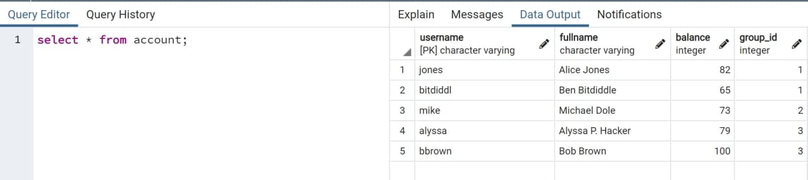

# Lab 10 Submission

## Task 1

#### Step 1

##### Terminal 1

Run the following query:

```sql
BEGIN;
set transaction isolation level read uncommitted;
select * from account;
```

The output we get:


#### Step 2

##### Terminal 2

Running the following:

```sql
BEGIN;
set transaction isolation level read uncommitted;
update account set username = 'ajones' where fullname='Alice Jones';
```

#### Step 3

##### Terminal 1

```sql
select * from account;
```

We get:



#### Step 4

##### Terminal 2

```sql
select * from account;
```

We get:


The outputs are different due to the reason that changes have not been committed in terminal 2. That happens because a query in the current transaction cannot read data modified by another transaction that has not yet committed, thus preventing **dirty reads**

#### Step 5

##### Terminal 2

```sql
commit;
```


Terminal 1 output after committing:


Terminal 2 output after committing:


#### Step 6

##### Terminal 2

```sql
end;
begin;
```

#### Step 7

##### Terminal 1

```sql
update account 
set balance = balance + 10 
where fullname ='Alice Jones'
```

Output:


The changes need to be committed before running the next step, otherwise we will have execution error.

#### Step 8

##### Terminal 2

After committing the changes in Terminal 1 we can run the following:

```sql
update account 
set balance = balance + 20 
where fullname='Alice Jones'
```

Output:


#### Step 9

##### Terminal 1

```sql
commit;
```

#### Step 10

##### Terminal 2

```sql
ROLLBACK;
```

###### Explain the output from the second terminal

**Read committed**: the balance will be +20 because the first update in terminal 1 is lost and that is due to the inability of this isolation to protect data update.
**Repeatable Read**: the balance will be +30 because +10 and +20 will be added to the balance together due to the ability for this isolation to protect data update.

## Task 2

#### Step 1

##### Terminal 1

```sql
Begin;
set transaction isolation level Repeatable read;
Select * from account where group_id = 2;
```

#### Step 2

##### Terminal 2

```sql
Begin;
set transaction isolation level Repeatable read;
Update account set group_id = 2 where username = 'bbrown';
```

###### Explaining the results for this isolation levels:

Read committed: The results are not the same on both terminals because updating +15 and the inability of this isolation to protect the data from non-repeatable read.

Repeatable read: The results are the same on both terminals and that is because this isolation level protects the data from non-repeatable read.

## Task 3

#### Step 1

##### Terminal 1 and 2

Start a transaction in both terminals:

```sql
begin;
```

#### Step 2

##### Terminal 1 and 2

```sql
set transaction isolation level Repeatable read;
```

###### Explaining the results for this isolation level

Both isolation levels (Repeatable read, Serializable) protect the data from non-repeatable read. Then the read in the first terminal will not include Bob in the second group because Bob is moved to the second group in the second terminal.

