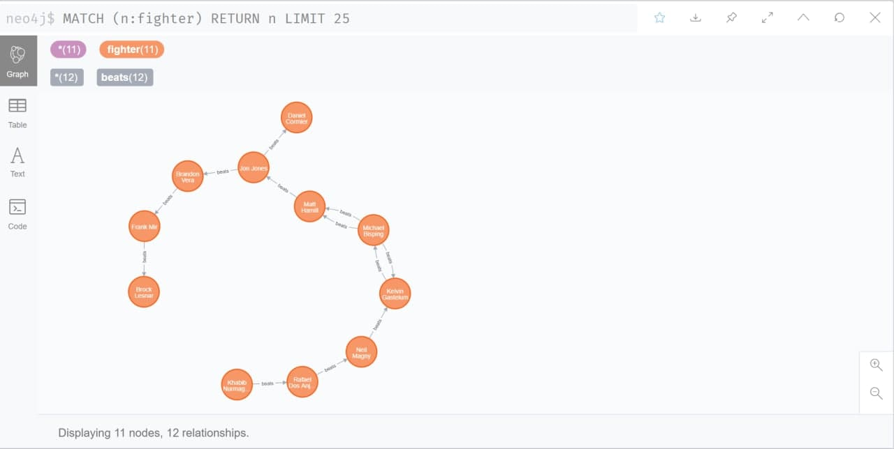
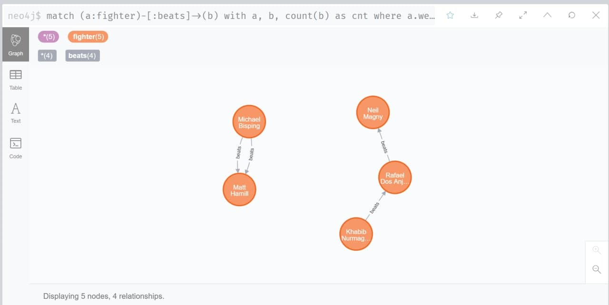
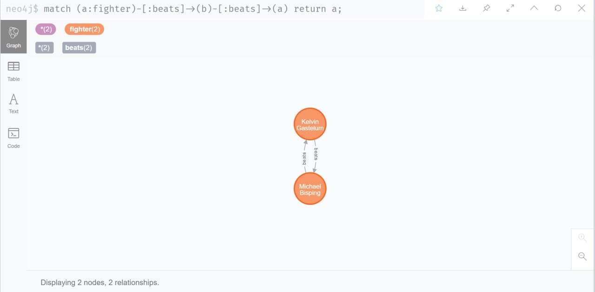
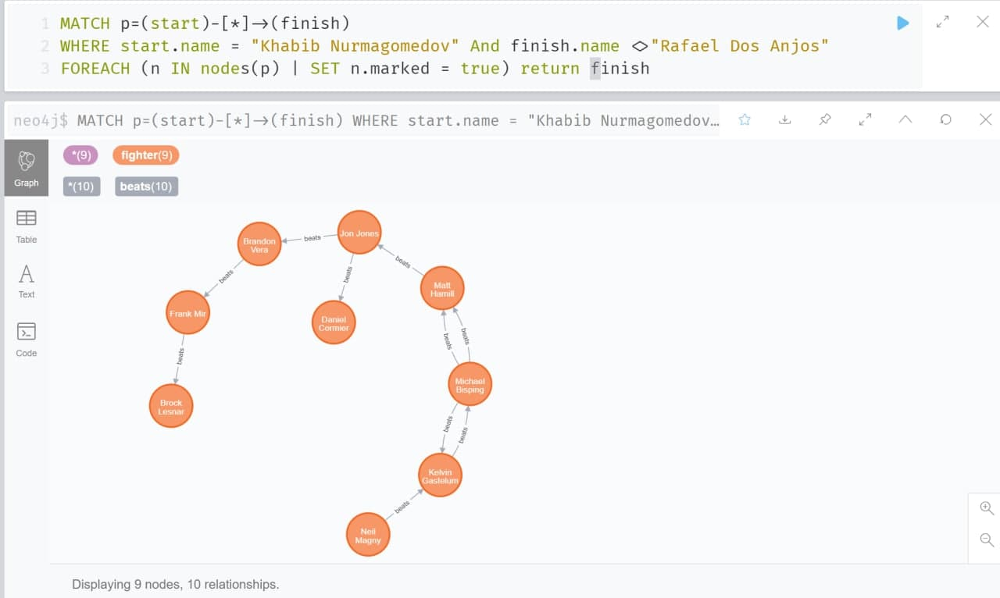
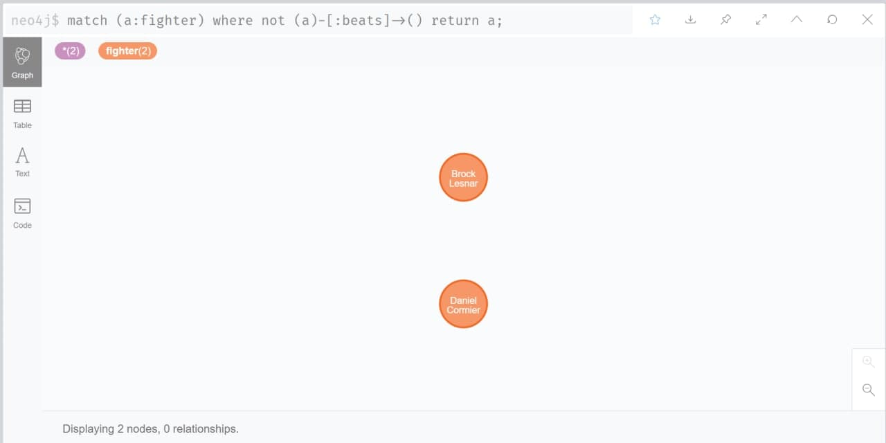
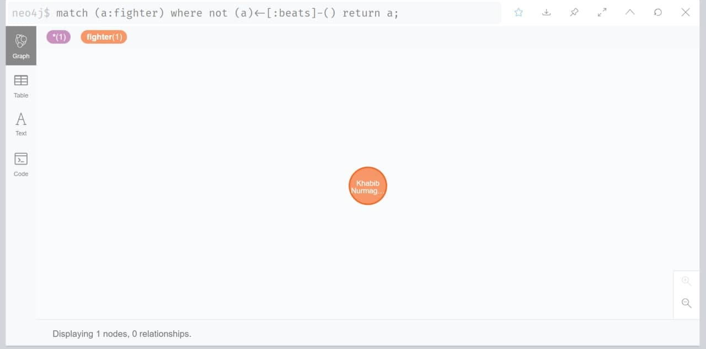

# Lab 11 Submission

## Graph Databases (Neo4J)

### Exercise 1

#### Part 1:

The relationships between the fighters are represented in the following queries:

```cypher
create (a:fighter {name: "Khabib Nurmagomedov", weight:"155"}),(b:fighter {name: "Rafael Dos Anjos", weight:"155"}), (a)-[:beats]->(b);

match (a:fighter) return a;

match (a:fighter) where a.name = "Rafael Dos Anjos" 
create (b:fighter {name: "Neil Magny", weight: "170"}),
(c:fighter {name: "Jon Jones", weight: "205"}),
(d:fighter {name: "Daniel Cormier", weight: "205"}),
(e:fighter {name: "Michael Bisping", weight: "185"}),
(f:fighter {name: "Matt Hamill", weight: "185"}),
(g:fighter {name: "Brandon Vera", weight: "205"}),
(h:fighter {name: "Frank Mir", weight: "230"}),
(i:fighter {name: "Brock Lesnar", weight: "205"}),
(j:fighter {name: "Kelvin Gastelum", weight: "205"}),
(a)-[:beats]-> (b),
(c)-[:beats]-> (d),
(e)-[:beats]-> (f),
(c)-[:beats]-> (g),
(g)-[:beats]-> (h),
(h)-[:beats]-> (i),
(b)-[:beats]-> (j),
(j)-[:beats]-> (e),
(e)-[:beats]-> (f),
(e)-[:beats]-> (j),
(f)-[:beats]-> (c);
```

The result in graph:




#### Part 2:

Return all middle/Walter/light weight fighters (155,170,185) who at least have one
win

```cypher
match (a:fighter)-[:beats]->(b) 
with a, b, count(b) as cnt
where a.weight in ["155", "170", "185"] and cnt > 0 return a, count(b);
```




Return fighters who had 1-1 record with each other. Use Count from the aggregation
functions

```cypher
match (a:fighter)-[:beats]->(b)-[:beats]->(a) return a;
```




Return all fighter that “Khabib Nurmagomedov” can beat them and he didn’t have a
fight with them yet

```cypher
MATCH p=(start)-[*]->(finish)
WHERE start.name = "Khabib Nurmagomedov" And finish.name <>"Rafael Dos Anjos"
FOREACH (n IN nodes(p) | SET n.marked = true) return finish
```




Return undefeated Fighters(0 loss) 

```cypher
match (a:fighter)
where not (a)-[:beats]->()
return a;
```




Return defeated fighter (0 wins)

```cypher
match (a:fighter)
where not (a)<-[:beats]-()
return a;
```

